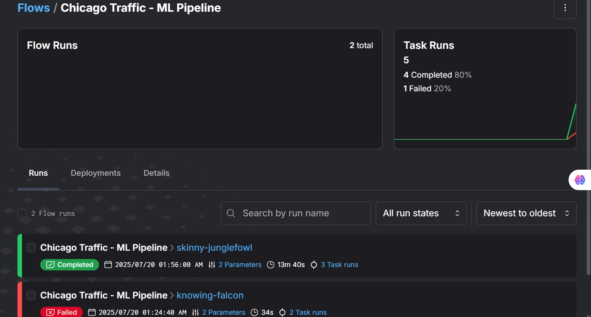

# 🚦 Prédiction de la gravité des accidents de la route à Chicago
## 02-Expérimentation

Bienvenue dans ce projet MLOps complet basé sur les données d’accidents de la ville de **Chicago**.  
Ce pipeline inclut : ingestion, prétraitement, entraînement automatique avec **MLflow**, et orchestration planifiée avec **Prefect** 🧠⚙️

---

## 📌 Objectifs du projet

- 🔄 Construire un **pipeline ML automatisé**
- 🧹 Prétraiter les données dynamiquement
- 🧠 Entraîner un modèle avec hyperparamètres optimaux
- 🚀 Orchestrer le workflow avec **Prefect**
- 📊 Suivre les performances dans **MLflow**

---

## ⚙️ Installation, Configuration & Exécution

### 🧱 Installation de l’environnement

```bash
python -m venv .venv
source .venv/bin/activate  # Windows: .venv\Scripts\activate
pip install -r requirements.txt
```

Contenu minimal de `requirements.txt` :

```txt
prefect==2.14.21
scikit-learn
pandas
numpy
joblib
mlflow
optuna
```

---

### ⚙️ Configuration de Prefect (local)

Lance Prefect dans **2 terminaux différents** :

#### ① Terminal 1 – Lancer l’interface Prefect

```bash
prefect server start
```

👉 Visiter : [http://127.0.0.1:4200](http://127.0.0.1:4200)

#### ② Terminal 2 – Configurer API + Pool + Worker

```bash
prefect config set PREFECT_API_URL="http://127.0.0.1:4200/api"
prefect work-pool create --type process my-pool
prefect worker start -p my-pool
```

---

### 🚀 Lancer manuellement le pipeline

```bash
python train_flow.py --month 7 --year 2025
```

✔️ Ce pipeline va :
- 📥 Télécharger les données du mois concerné
- 🔗 Les concaténer avec les anciennes
- 🧹 Les prétraiter automatiquement
- 🧠 Entraîner un modèle `RandomForestClassifier`
- 📊 Suivre les performances via **MLflow**

---

### 🔁 Créer un déploiement automatique (mensuel)

```bash
python train_flow.py --deploy
```

📅 Ce déploiement :
- Exécute le pipeline chaque mois automatiquement
- Utilise le work-pool nommé `my-pool`

---

## 📁 Structure du projet

```bash
.
├── prepare_data.py               # Prétraitement + transformation des données
├── train_rf_optuna.py            # Entraînement + suivi MLflow
├── train_flow.py                 # Orchestration complète avec Prefect
├── data/
│   └── new_data.csv              # Données brutes téléchargées via API
├── processed_data/
│   ├── X_prepared.csv            # Données features
│   ├── y_prepared.csv            # Données cibles
│   └── preprocessor.joblib       # Pipeline de transformation Sklearn
├── image/
├── README.md
└── requirements.txt
```

---

## 🧠 Contenu des scripts

### `prepare_data.py`

- Nettoie et transforme les données
- Applique :
  - Encodage One-Hot
  - Encodage fréquentiel
  - Standardisation
- Sauvegarde les features (`X_prepared.csv`), la cible (`y_prepared.csv`) et le pipeline (`preprocessor.joblib`)

### `train_rf_optuna.py`

- Entraîne un `RandomForestClassifier` avec les meilleurs paramètres :

```python
BEST_PARAMS = {
    'n_estimators': 58,
    'max_depth': 28,
    'min_samples_split': 4,
    'min_samples_leaf': 4,
    'class_weight': None,
    'random_state': 42
}
```

- Logue les métriques dans **MLflow** (Accuracy, F1-score, ROC AUC)

### `train_flow.py`

- Orchestration Prefect complète :
  - Téléchargement dynamique via API de Chicago
  - Prétraitement et enrichissement de l’historique
  - Réentraînement du modèle
  - Prise en charge de l'exécution manuelle et du déploiement automatique mensuel

---

## 📸 Interface Prefect (captures d’écran)

Ajoute ici les images suivantes dans le dossier `images/` :

1. **Dashboard Prefect**  
   

2. **Flow exécuté**  
   

3. **Logs d’exécution**  
   

4. **Vue des tâches**  
   

5. **Vue Linux**  
   

6.

---

## 🧪 Suivi des expériences avec MLflow

Lance l’interface MLflow localement avec :

```bash
mlflow ui
```

Accès à l’interface : [http://127.0.0.1:5000](http://127.0.0.1:5000)

---

## ✅ Commandes récapitulatives

```bash
# 1. Lancer Prefect UI
prefect server start

# 2. Configurer et démarrer un pool
prefect config set PREFECT_API_URL="http://127.0.0.1:4200/api"
prefect work-pool create --type process my-pool
prefect worker start -p my-pool

# 3. Lancer le pipeline manuellement
python train_flow.py --month 7 --year 2025

# 4. Créer un déploiement automatique
python train_flow.py --deploy

# 5. Suivre les expériences
mlflow ui
```

---

## 📚 Références

- Données : [Traffic Crashes - Crashes (Chicago)](https://data.cityofchicago.org/Transportation/Traffic-Crashes-Crashes/85ca-t3if)
- [Prefect Documentation](https://docs.prefect.io/)
- [MLflow Documentation](https://mlflow.org/)

---

## 👨‍💻 Réalisé par : *KAMAGATE YOUSSOUF*

Projet final — MLOps Bootcamp – DataTalksClub
