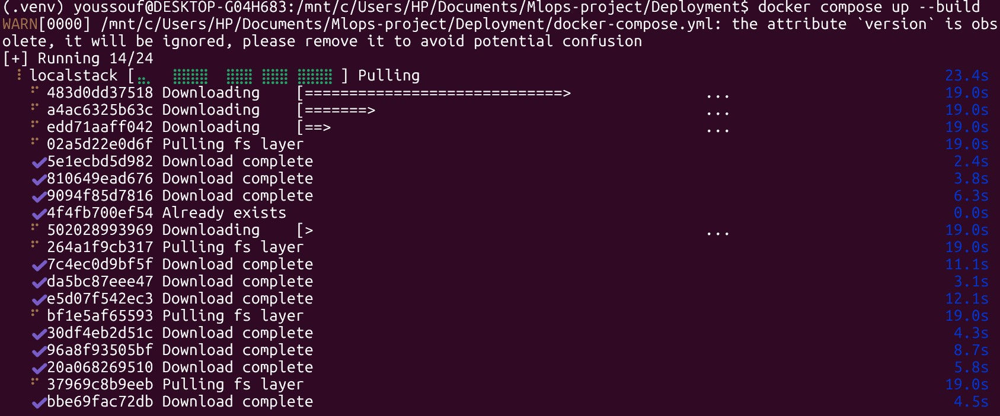
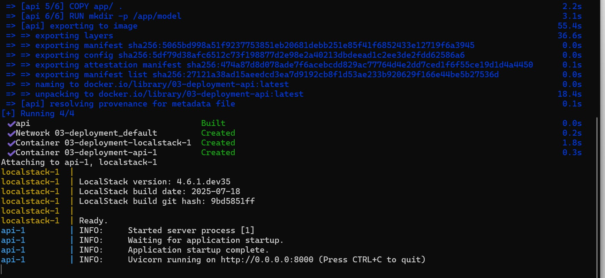
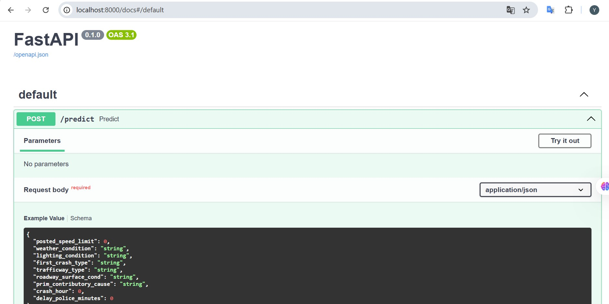
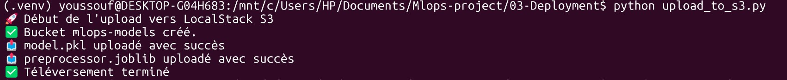
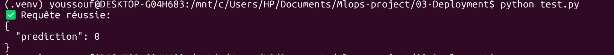

# 🚦 Prédiction de la gravité des accidents de la route à Chicago
## 03-Deployment

Ce projet montre comment déployer localement un modèle de classification prédictive entraîné sur les données d'accidents de la ville de Chicago. L'objectif est de prédire si un accident sera **grave ou non** (`INJURY AND / OR TOW DUE TO CRASH`) à l'aide de :

- ⚡ **FastAPI**
- 🐳 **Docker & Docker Compose**
- 💾 **LocalStack** (simulateur AWS)
- 📤 **Stockage S3** simulé
- 🤖 **Modèle RandomForest** logué avec **MLflow**

---

## 📁 Structure du projet

```
deployment/
├── app/
│   ├── model/
│   │   ├── model.pkl                 ← Modèle exporté depuis MLflow
│   │   └── preprocessor.joblib       ← Pipeline de prétraitement
│   ├── predict.py                    ← API FastAPI
│   └── requirements.txt              ← Dépendances de l’API
├── upload_to_s3.py                   ← Script d’upload vers S3 (LocalStack)
├── docker-compose.yml                ← Lance API + LocalStack
├── Dockerfile                        ← Image Docker pour FastAPI
├── test.py                           ← Envoie une requête de test
├── images/
│   ├── image1.png                    ← Docker up
│   ├── image2.png                    ← API prête
│   ├── image3.png                    ← Upload S3 réussi
│   └── image4.png                    ← Réponse de l’API
```

---

## ⚙️ Étapes d’exécution

### 🧪 1. Créer un environnement virtuel

```bash
cd deployment/
python3 -m venv .venv
source .venv/bin/activate  
```

### 📦 2. Installer les dépendances

```bash
pip install -r app/requirements.txt
pip install boto3 localstack awscli
```

---

### 🐳 3. Lancer l’environnement Docker

```bash
docker-compose up --build
```

Cela va :
- Lancer **LocalStack** (simulateur de services AWS)
- Construire l’image de l’**API FastAPI**
- Démarrer le serveur sur `http://localhost:8000`

🖼️ *Image 1 — Docker Compose en cours :*  


🖼️ *Image 2 — FastAPI active :*  



---

### 📤 4. Uploader le modèle et le préprocesseur

Dans un second terminal :

```bash
python upload_to_s3.py
```

Cela envoie :
- `model.pkl`
- `preprocessor.joblib`

vers le **bucket S3 simulé** nommé `mlops-models`.

🖼️ *Image 3 — Upload dans LocalStack :*  


---

### 📬 5. Tester l’API de prédiction

```bash
python test.py
```

✅ Réponse :

```json
{
  "prediction": 0
}
```

🖼️ *Image 4 — Réponse de l’API :*  


---

### 🧾 (Optionnel) Vérifier les objets dans S3

1. Configurer un profil AWS localstack :

```bash
aws configure --profile localstack
```

Utiliser :
- Access Key : `test`
- Secret Key : `test`
- Region : `us-east-1`

2. Lister le contenu du bucket :

```bash
aws s3 ls s3://mlops-models --endpoint-url=http://localhost:4566 --profile localstack
```

---

## 🧠 API Swagger UI

Accéder à l’interface :  
👉 http://localhost:8000/docs

Tu peux tester directement une requête POST comme :

```json
{
  "posted_speed_limit": 30,
  "weather_condition": "CLEAR",
  "lighting_condition": "DAYLIGHT",
  "first_crash_type": "REAR END",
  "trafficway_type": "ONE-WAY",
  "roadway_surface_cond": "DRY",
  "prim_contributory_cause": "FOLLOWING TOO CLOSELY",
  "crash_hour": 14,
  "delay_police_minutes": 5.0
}

```
Voir plus dans **test.py**

---

## ✅ Récapitulatif

| Éléments                  | Statut     |
|---------------------------|------------|
| Modèle logué avec MLflow  | ✅ oui     |
| API FastAPI conteneurisée | ✅ oui     |
| Stockage Cloud (S3)       | ✅ simulé |
| Déploiement Cloud         | ✅ localstack |
| Test HTTP JSON            | ✅ oui     |

---

## 👨‍💻 Auteur

Projet réalisé par **Youssouf Kamagate**  
 
