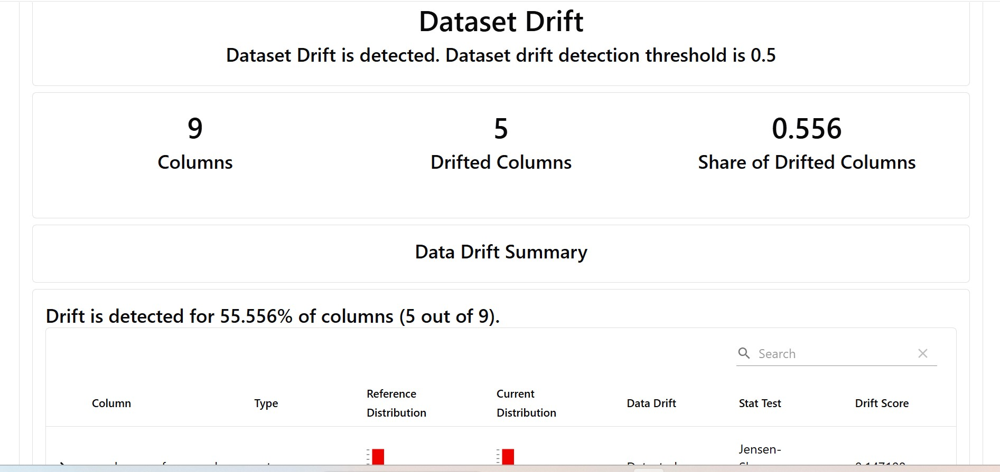
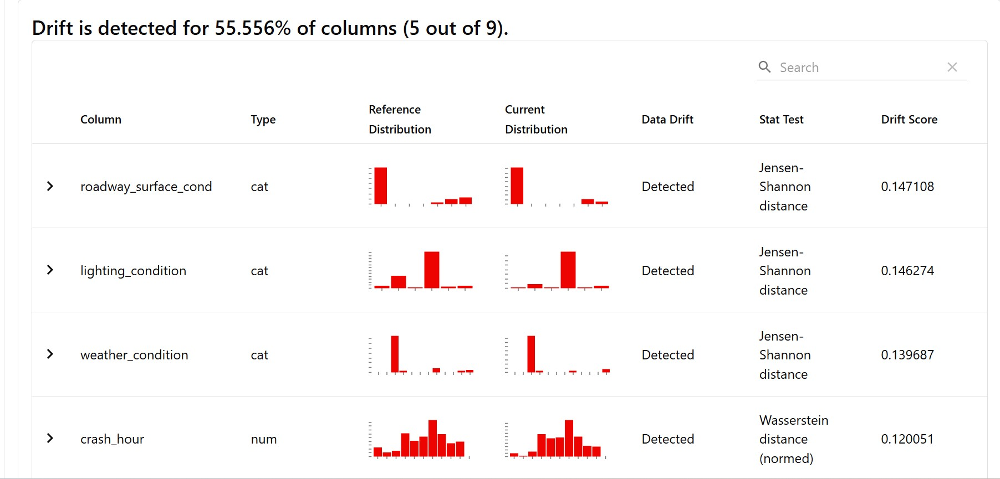
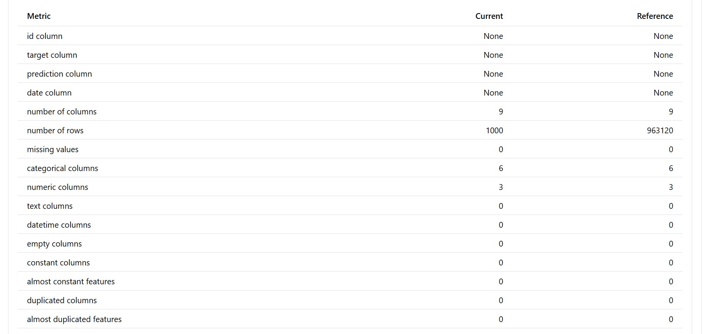

# 📊 Prédiction de la gravité des accidents de la route à Chicago – Monitoring de Drift avec Evidently

Ce dossier `monitoring/` contient un pipeline de **détection de dérive (drift)** des données en utilisant la librairie [`evidently`](https://docs.evidentlyai.com/).  
Il compare les **anciennes données (référence)** avec les **nouvelles données reçues** pour détecter toute anomalie statistique ou changement de distribution.

---

## ✅ Objectifs

- 🧠 Vérifier si les nouvelles données sont statistiquement différentes des anciennes
- ⚠️ Détecter automatiquement les problèmes de qualité ou de stabilité du modèle
- 📈 Générer des **rapports visuels interactifs** en HTML pour le suivi du modèle

---

## 🗂 Structure des fichiers

```
```
monitoring/
├── monitoring.ipynb                    # Notebook principal pour créer le rapport de drift
├── data/
│   ├── Traffic_Crashes.csv            # Données historiques (référence)
│   └── new_data.csv                   # Données récentes (à surveiller)
├── report/
│   └── drift_column_mapping1.html     # Rapport HTML généré par Evidently
├── images/                   
├── requirements.txt
└── README.md                          # Ce fichier
```

---

## 🧪 Script principal

Le script `monitoring.ipynb` :

- Harmonise les noms de colonnes (`lowercase`)
- Calcule le délai entre l'accident et la notification de la police
- Conserve les colonnes pertinentes (numériques + catégorielles)
- Déclare un `DataDefinition` (métadonnées pour Evidently)
- Crée deux objets `Dataset` pour la comparaison
- Exécute deux rapports intégrés :
  - `DataDriftPreset()` : dérive statistique
  - `DataSummaryPreset()` : résumé des données

### 📌 Extrait important
```python
data_definition = DataDefinition(
    numerical_columns=num_features,
    categorical_columns=cat_features,
)

ref_dataset = Dataset.from_pandas(train_data, data_definition=data_definition)
cur_dataset = Dataset.from_pandas(val_data, data_definition=data_definition)

report = Report(metrics=[
    DataDriftPreset(),
    DataSummaryPreset(),
])
report.run(reference_data=ref_dataset, current_data=cur_dataset)
report.save_html("report/drift_column_mapping1.html")
```

---

## ▶️ Lancer le script

Le script est un **notebook Jupyter** :

```bash
jupyter notebook monitoring.ipynb
```

On peux aussi le convertir en script `.py`
```bash
jupyter nbconvert --to script monitoring.ipynb
```

✅ Une fois exécuté, tu obtiendras un rapport HTML généré ici :

```
monitoring/report/drift_column_mapping1.html
```
---

## 📌 Dépendances

Voici les principales bibliothèques nécessaires :

```bash
pip install evidently pandas jupyter
```

💡 Tu peux aussi ajouter un fichier `requirements.txt` :

```txt
pandas
evidently==0.7.11
jupyter
```

---

## 📸 Aperçu du rapport (Exemple)

Ajoute ici quelques captures d'écran dans la section :


## 🖼️ Exemples de rapports

**Drift Détecté** 

  



**Statistiques Globales**
 

plus de details dans le rapport 

---

## 🧠 Notes techniques

- La colonne `delay_police_minutes` est dérivée des dates d'accident et de notification
- Aucune colonne "target" ou "prediction" n’est requise ici car le drift est mesuré **sur les features**
- Le mapping des colonnes est fait automatiquement via `DataDefinition` (v0.7+)
- Pas besoin d'utiliser la vieille API `legacy.metrics` dans ce script

---


## 📁 Pour aller plus loin

- [Documentation Evidently](https://docs.evidentlyai.com/)
- [Drift detection concepts](https://evidentlyai.com/blog/data-drift-detection)
- [MLops Zoomcamp — Monitoring](https://github.com/DataTalksClub/mlops-zoomcamp/tree/main/05-monitoring)

---

📍 Projet réalisé dans le cadre du suivi des incidents de circulation à Chicago 🚗  
