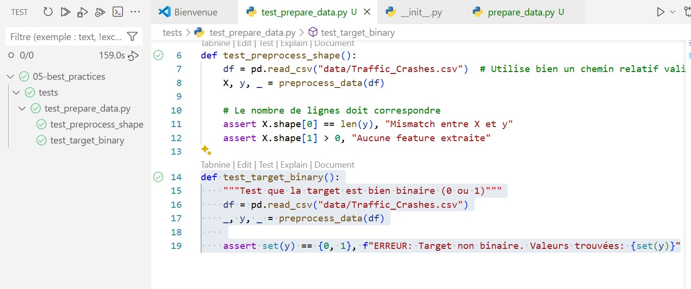
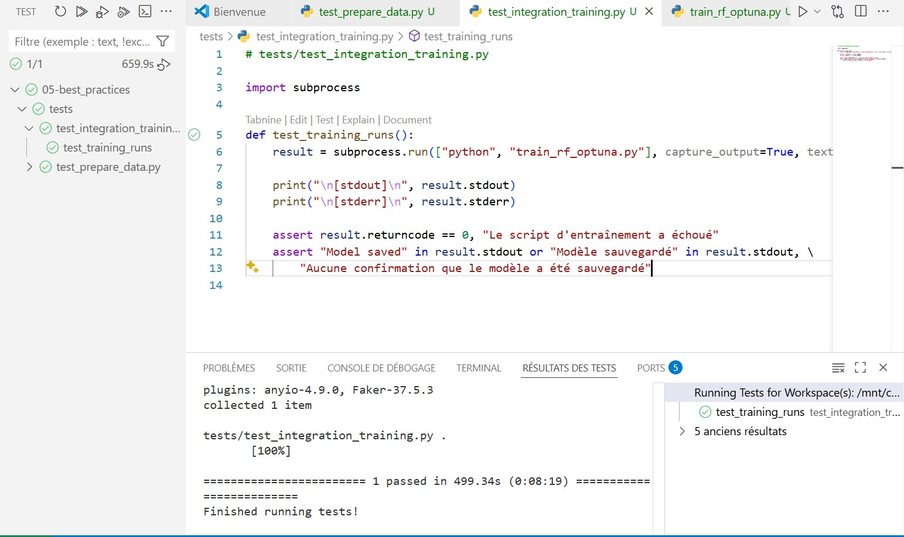
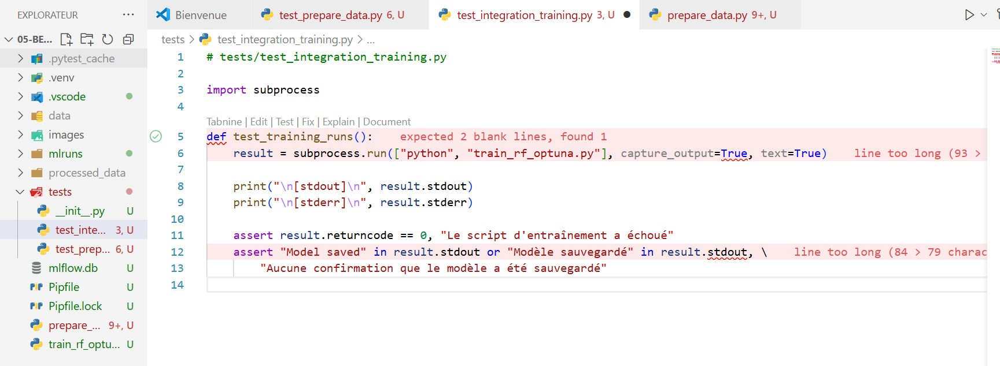

# ✅ 05 – Bonnes Pratiques (Best Practices)

Ce dossier applique toutes les **bonnes pratiques de développement logiciel** à un projet MLOps sur les accidents de la route à Chicago 🚗

---

## 🎯 Objectifs

- Écrire du code maintenable, lisible, réutilisable
- Détecter les erreurs automatiquement (tests)
- Automatiser les tâches répétitives (Makefile)
- Garantir une qualité de code (Linting, Pre-commit)
- Ajouter une pipeline CI/CD sur GitHub Actions

---

## 🧱 Arborescence

```
05-best_practices/
├── README.md
├── .pre-commit-config.yaml   # hooks git
├── Makefile                  # commandes automatiques
├── Pipfile / Pipfile.lock    # env virtuel pipenv
├── .github                     # CI/CD
├── tests/
│   ├── test_prepare_data.py           # ✅ test unitaire
│   └── test_integration_training.py   # ✅ test d’intégration
├── prepare_data.py
├── train_rf_optuna.py
├── images/
│   ├── unitaire1.jpg
│   ├── INTEGRATION.jpg
│   └── erreur.jpg
└── .github/
    └── workflows/
        └── ci.yml           # ✅ GitHub Actions
```

---

## ✅ 1. Tests

### 🧪 Test unitaire – `test_prepare_data.py`

Teste que le prétraitement de données produit bien `X` et `y` cohérents.

📸 Exemple :



---

### 🧪 Test d’intégration – `test_integration_training.py`

Teste que le script d’entraînement complet s’exécute **sans crash**.

📸 Exemple :



---

## ✅ 2. Qualité du Code

### 🧼 Formatage avec Black

```bash
make format
```

Black reformate tout automatiquement : indentations, lignes vides, etc.

### 🧪 Vérification avec Flake8

```bash
make lint
```

Flake8 détecte les erreurs de style et lignes trop longues.

📸 Exemple d’erreur :



---

## ✅ 3. Hooks Pre-commit

Avant chaque `git commit`, on vérifie automatiquement :

| Hook                    | Description                          |
|-------------------------|--------------------------------------|
| `black`                 | Formate le code                     |
| `flake8`                | Linting (PEP8)                      |
| `check-added-large-files` | Empêche les fichiers > 1 Mo       |
| `end-of-file-fixer`     | Rajoute une ligne vide à la fin     |
| `trailing-whitespace`   | Supprime les espaces inutiles       |
| `yesqa`                 | Nettoie les `# noqa` inutiles       |

### ▶️ Installation

```bash
pipenv install --dev pre-commit
pre-commit install
make precommit
```

---

## ✅ 4. Makefile

```makefile
install:
	pipenv install --dev

lint:
	flake8 .

format:
	black .

test:
	pytest

precommit:
	pre-commit run --all-files

run:
	pytest tests/test_prepare_data.py tests/test_integration_training.py
```

---

## ✅ 5. CI/CD – GitHub Actions

📄 `.github/workflows/ci.yml` :

- Exécute automatiquement :
  - Lint
  - Format check
  - Tests

🔁 À chaque `push` ou `pull_request`


## ✅ Comment utiliser

```bash
# 1. Créer l'env
pipenv install --dev

# 2. Lancer les tests
make test

# 3. Formater automatiquement
make format

# 4. Vérifier les erreurs
make lint

# 5. Forcer les bonnes pratiques
make precommit
```

---

## 🔗 Liens utiles

- [PEP8 Python style guide](https://peps.python.org/pep-0008/)
- [Black documentation](https://black.readthedocs.io/)
- [Pre-commit hooks](https://pre-commit.com/)
- [GitHub Actions](https://docs.github.com/en/actions)

