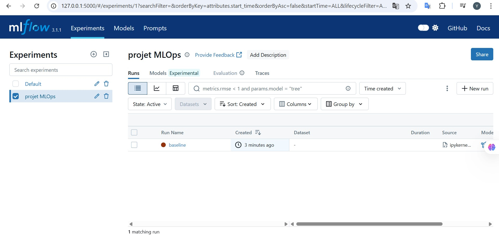
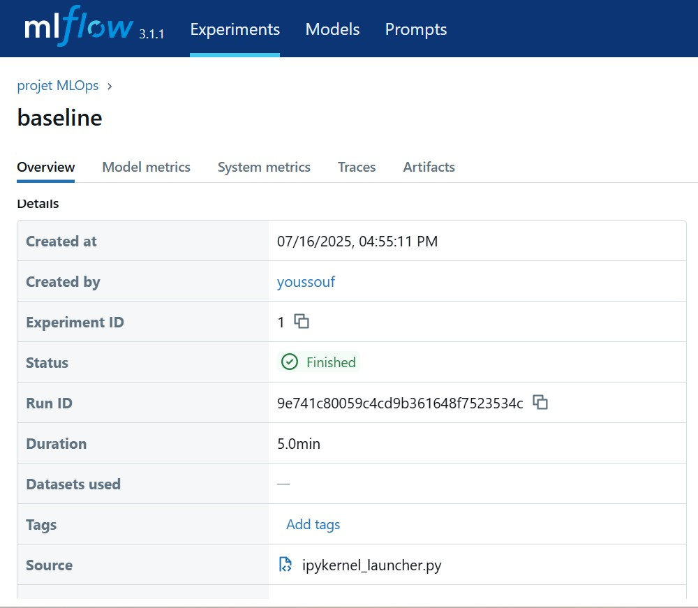
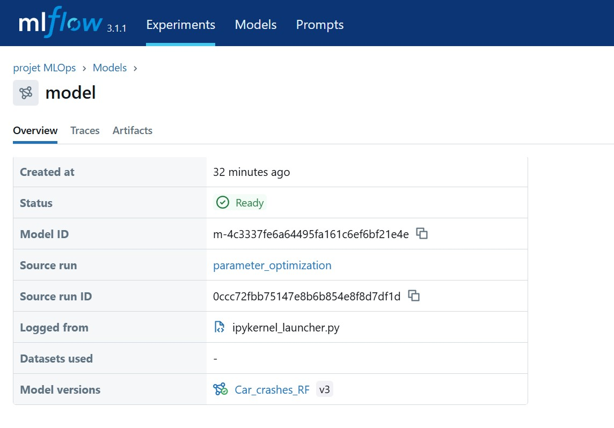
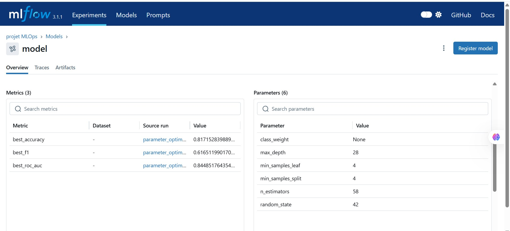
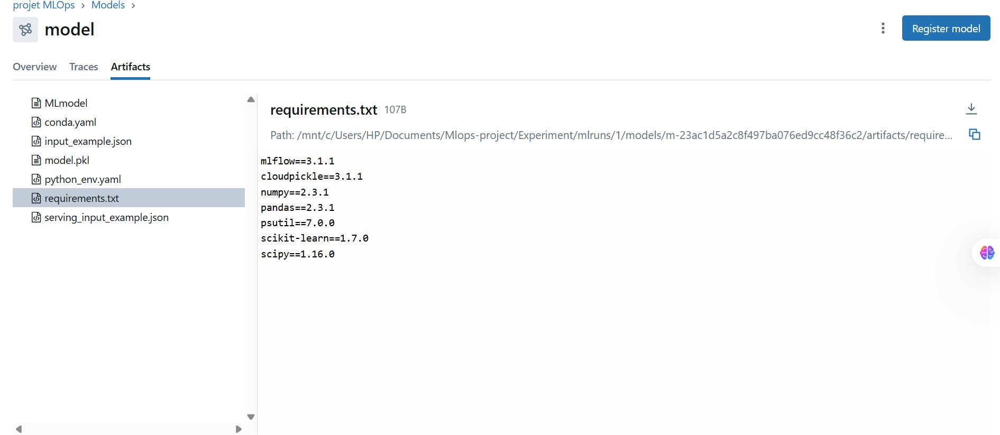

# Suivi et Optimisation des Modèles avec MLflow et Optuna (Expérimentation)

Cette section fait partie du projet principal de prédiction de la gravité des accidents à Chicago. Elle est consacrée à l'expérimentation, au suivi d'expériences et à l'optimisation des modèles grâce à **MLflow** et **Optuna**.

Le travail est réalisé dans le notebook `experimentation.ipynb`, qui comprend deux grandes étapes :

- Entraînement d'un modèle **baseline** (Random Forest sans recherche d'hyperparamètres)
- Optimisation des hyperparamètres du modèle avec **Optuna**, tout en suivant les expériences avec MLflow

---

## 📊 Suivi du Modèle Baseline avec MLflow

Un modèle Random Forest a été entraîné avec des paramètres par défaut. L'ensemble du run est journalisé via MLflow.

- Paramètres : `n_estimators=100`, `max_depth=None`, etc.
- Métriques : `accuracy`, `f1-score`, `roc_auc`
- Artefacts : modèle, signature, exemple d'entrée

### Interface MLflow du modèle de base



### Aperçu du modèle enregistré



---

## 🚀 Optimisation avec Optuna + Tracking avancé (nested runs)

Une recherche d'hyperparamètres a été réalisée avec **Optuna** en maximisant l'accuracy sur l'ensemble de validation. Chaque essai est enregistré comme un run imbriqué (nested=True) dans MLflow.

- Paramètres optimisés : `n_estimators`, `max_depth`, `min_samples_split`, `min_samples_leaf`, `class_weight`
- Suivi de chaque run avec `mlflow.start_run(nested=True)`
- Journalisation du meilleur modèle dans MLflow

### Aperçu du modèle optimisé



### Métriques du modèle optimisé



### Artefacts enregistrés



---

## 📖 Notes techniques

- L'ensemble des expériences est exécuté en local avec MLflow et une base SQLite (`mlflow.db`)
- Les modèles sont stockés dans le dossier `mlruns/`
- Le run principal est taggé `parameter_optimization`, chaque essai a son propre run imbriqué
- Le meilleur modèle est logué avec signature et exemple d'entrée pour une future utilisation

---

## 📊 Exemple de rechargement et prédiction

```python
import mlflow.sklearn
model_id = "m-4c3337fe6a64495fa161c6ef6bf21e4e"
model_path = f"mlruns/1/models/{model_id}/artifacts"
# Charger le modèle
model = mlflow.sklearn.load_model(model_path)
# Prédire
y_pred = model.predict(X_train)
# Afficher les 10 premières prédictions
y_pred[:10]
