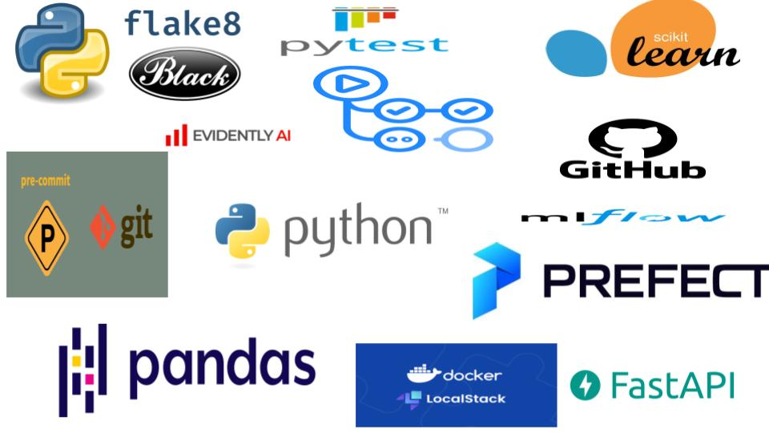
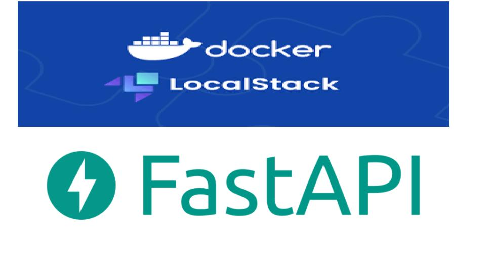

# 🚦 Prédiction de la gravité des accidents de la route à Chicago

> **Projet MLOps de bout en bout** : collecte, traitement, entraînement, déploiement, monitoring et bonnes pratiques sur des données réelles d’accidents à Chicago.

---

## 📊 Problématique

Chaque année, des milliers d'accidents de la circulation sont enregistrés à Chicago. Ces accidents varient en gravité : certains n'entraînent que des dégâts matériels mineurs, tandis que d'autres causent des blessures, des décès ou nécessitent l’intervention de remorquage.

**Problème posé :**
> Peut-on prédire la gravité d’un accident de la route à Chicago en se basant uniquement sur des informations connues au moment du signalement (conditions météo, heure, lieu, type de route, etc.) ?

Ce projet vise à construire un pipeline de Machine Learning complet capable de prédire si un accident sera :
- **Grave** : au moins un blessé ou un remorquage (1)
- **Non grave** : aucun blessé, aucun remorquage (0)

L’objectif est d’**automatiser cette prédiction** pour aider :
- les autorités à **anticiper les interventions**
- les services de la ville à **mieux répartir les ressources**
- les analystes à **identifier les zones ou facteurs à risque**

---

## 📂 Source des données

Données issues du portail OpenData Chicago :  
🔗 https://data.cityofchicago.org/Transportation/Traffic-Crashes-Crashes/85ca-t3if

---

## 🎯 Variable cible

Création d'une variable binaire à partir de `CRASH_TYPE` :

| Valeur originale                        | Cible |
|----------------------------------------|-------|
| `NO INJURY / DRIVE AWAY`               | 0     |
| `INJURY AND / OR TOW DUE TO CRASH`     | 1     |

---

## ⚙️ Stack technique

| Catégorie         | Outils utilisés                         |
|------------------|------------------------------------------|
| Langage          | `Python`                                 |
| Suivi d’expérience | `MLflow`                                |
| Orchestration    | `Prefect` (local)                        |
| Déploiement      | `FastAPI` + `LocalStack` + `Docker`      |
| Monitoring       | `Evidently`                              |
| Qualité code     | `pytest`, `black`, `flake8`, `pre-commit`|
| CI/CD            | `GitHub Actions`                         |

📸 

---

## ✅ Étapes réalisées

| Étape                                        | Statut |
|---------------------------------------------|--------|
| 🔍 Exploration et nettoyage des données      | ✔️     |
| 🎯 Création de la variable cible             | ✔️     |
| 🤖 Entraînement de plusieurs modèles         | ✔️     |
| 📈 Suivi avec MLflow                         | ✔️     |
| ⚙️ Orchestration avec Prefect                | ✔️     |
| 🐳 Déploiement API (FastAPI + Docker)        | ✔️     |
| ☁️ Simulation de S3 avec LocalStack          | ✔️     |
| 🧪 Monitoring de dérive (Evidently)          | ✔️     |
| 🧼 Tests, lint, formatage                    | ✔️     |
| 🚀 Pipeline CI/CD GitHub Actions             | ✔️     |

---

## 📌 Organisation des dossiers

```
📁 mlops-project  
├── 📁 01-Experiment                  # 📊 Suivi des expériences avec MLflow
│   ├── 📁 images                    # Captures d'écran de MLflow
│   ├── 📄 experimentation.ipynb    # Notebook d’entraînement + MLflow
│   └── 📄 README.md                 # Explication de l'étape d'expérimentation
│
├── 📁 02-Orchestration              # ⚙️ Orchestration des tâches avec Prefect
│   ├── 📁 images                    # Captures d'écran Prefect
│   ├── 📄 prepare_data.py          # Script de prétraitement
│   ├── 📄 train_rf_optuna.py       # Entraînement avec RF + Optuna
│   ├── 📄 train_flow.py            # Script de pipeline Prefect
│   ├── 📄 requirements.txt         # Dépendances nécessaires
│   └── 📄 README.md                 # Explication du pipeline orchestré
│
├── 📁 03-Deployment                 # 🚀 Déploiement de l’API avec Docker & FastAPI
│   ├── 📁 app                      # Code de l’API FastAPI (predict.py + model)
│   ├── 📁 images                   # Screenshots Docker, LocalStack
│   ├── 📁 localstack               # Fichiers spécifiques à S3 local
│   ├── 📄 docker-compose.yml       # Stack complète API + LocalStack
│   ├── 📄 Dockerfile               # Image Docker de l’API
│   ├── 📄 upload_to_s3.py         # Script d'upload vers S3 LocalStack
│   ├── 📄 test.py                  # Script de test local de l’API
│   └── 📄 README.md                # Explication du déploiement
│
├── 📁 04-Monitoring                # 📈 Détection de dérive avec Evidently
│   ├── 📁 images                   # Captures d'écran des rapports
│   ├── 📁 report                   # Rapport HTML généré
│   ├── 📄 monitoring.ipynb         # Analyse avec Evidently
│   ├── 📄 requirements.txt         # Dépendances spécifiques
│   └── 📄 README.md                # Explication du monitoring
│
├── 📁 05-best_practices            # ✅ Bonnes pratiques (tests, lint, CI/CD)
│   ├── 📁 .github                  # Workflows GitHub Actions
│   ├── 📁 images                   # Captures tests & erreurs lint
│   ├── 📁 tests                    # Tests unitaires et intégration
│   ├── 📄 .pre-commit-config.yaml  # Hooks pre-commit
│   ├── 📄 Makefile                 # Commandes automatiques (test, lint, etc.)
│   ├── 📄 mlflow.db                # Logs SQLite
│   ├── 📄 Pipfile / Pipfile.lock   # Env virtuel Pipenv
│   ├── 📄 prepare_data.py          # Fichier testé unitairement
│   ├── 📄 train_rf_optuna.py       # Script avec test d’intégration
│   └── 📄 README.md                # Documentation qualité / CI
├── 📁 images                       # Images globales du projet
├── 📄 .gitignore                   # Fichiers/dossiers à ne pas suivre
├── 📄 LICENSE                      # Licence open-source du projet
├── 📄 preparation.ipynb           # Notebook de nettoyage initial
├── 📄 prepare_data.py             # Script partagé globalement
├── 📄 requirements.txt            # Dépendances de base
└── 📄 README.md                   # README principal (présentation globale)

```

---

## 📊 Suivi des expériences – MLflow

- Enregistrement automatique des hyperparamètres
- Comparaison des modèles (logistique, RF, XGBoost)
- Interface locale accessible à `http://127.0.0.1:5000`

📸 

---

## ⛓️ Orchestration – Prefect

- Pipeline `train_flow.py` gérant :
  - téléchargement de nouvelles données
  - enrichissement historique
  - réentraînement du modèle

📸 

---

## ⚡ Déploiement local – FastAPI + Docker + LocalStack

- API conteneurisée via `Docker`
- Modèle et préprocesseur uploadés vers S3 LocalStack
- Testé via `test.py`

📸 

---

## 🧪 Monitoring – Evidently

- Comparaison de la dérive entre anciennes et nouvelles données
- Génération de rapport HTML interactif

📸 

---

## 🧪 Tests & Best Practices

- ✅ Tests unitaires (`prepare_data`)
- ✅ Tests d’intégration (`train_rf_optuna`)
- ✅ Linter (`flake8`)
- ✅ Formateur (`black`)
- ✅ Makefile
- ✅ Hooks `pre-commit`
- ✅ Pipeline CI/CD

---

## 🛠️ Makefile

```makefile
install:
	pipenv install --dev

lint:
	flake8 .

format:
	black .

test:
	pytest

precommit:
	pre-commit run --all-files

run:
	pytest tests/test_prepare_data.py tests/test_integration_training.py
```

---

## ⚙️ .pre-commit-config.yaml

```yaml
repos:
  - repo: https://github.com/psf/black
    rev: 24.4.2
    hooks:
      - id: black
        language_version: python3

  - repo: https://gitlab.com/pycqa/flake8
    rev: 7.0.0
    hooks:
      - id: flake8

  - repo: https://github.com/pre-commit/pre-commit-hooks
    rev: v4.5.0
    hooks:
      - id: check-added-large-files
        args: ['--maxkb=1024']
      - id: end-of-file-fixer
      - id: trailing-whitespace

  - repo: https://github.com/asottile/yesqa
    rev: v1.4.0
    hooks:
      - id: yesqa
```

---

## 📂 .gitignore recommandé

```
# Data
data/
processed_data/
*.csv
*.joblib
mlruns/
report/

# IDE / Python
.venv/
__pycache__/
*.pyc
.ipynb_checkpoints/
```

---

## 🔗 Ressources

- [MLflow](https://mlflow.org/)
- [Prefect](https://docs.prefect.io/)
- [Evidently](https://docs.evidentlyai.com/)
- [DataTalksClub MLOps Zoomcamp](https://github.com/DataTalksClub/mlops-zoomcamp)

---

## 🧠 Réalisé par

## 👨‍💻 Auteur

Projet réalisé par **Youssouf KAMAGATE**  
Dans le cadre du **MLOps Zoomcamp** 2025 — [DataTalksClub](https://github.com/DataTalksClub/mlops-zoomcamp)


